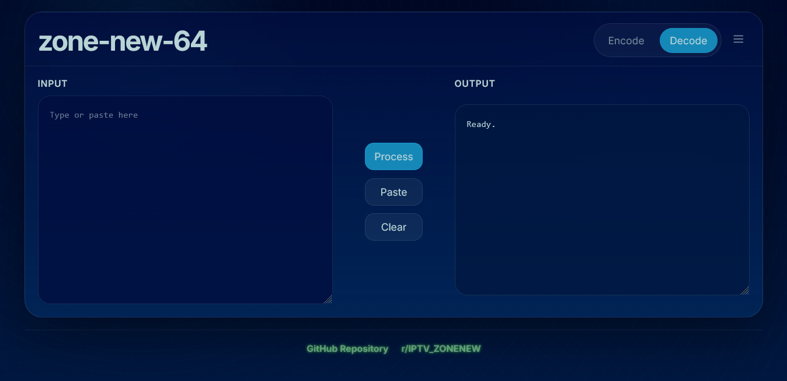
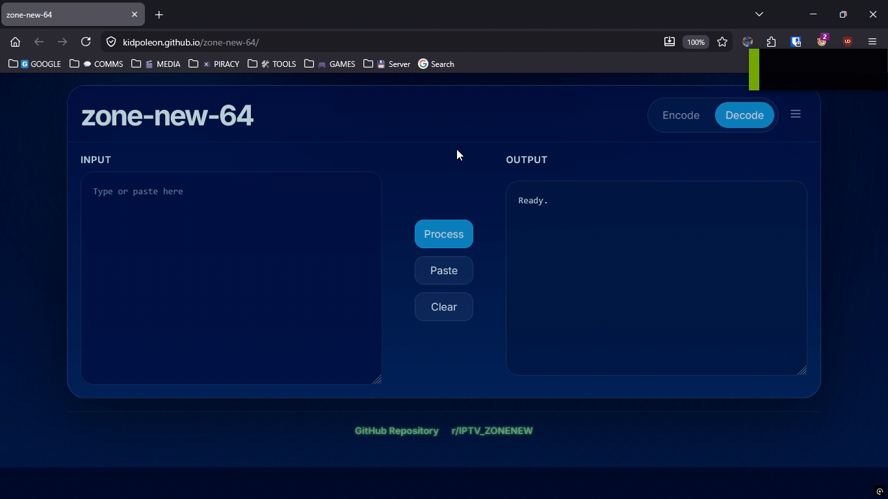

# zone-new-64

A modern, web-based Base64 encoder/decoder with advanced features and a sleek dark theme.

## Screenshots

## Quick Start

1. Open the web application
2. Select "Encode" or "Decode" mode
3. Paste your text into the input field
4. Click "Process" to encode or decode
5. Copy the result or use detected URL features

## Features

- **Encode/Decode**: Switch between encoding and decoding Base64 strings
- **Bulk Processing**: Process multiple lines at once
- **Dirty Scan**: Automatically detect and extract Base64 from mixed content
- **URL-Safe Mode**: Use URL-safe Base64 variants (`-` and `_` instead of `+` and `/`)
- **Whitespace Stripping**: Remove all whitespace from input
- **Padding Repair**: Automatically fix missing padding characters
- **URL Detection**: Detect URLs in decoded output with quick copy/open actions
- **Responsive Design**: Works on desktop and mobile devices
- **Dark Theme**: Easy on the eyes with a modern aesthetic

## Controls (☰ Menu)

- **Bulk**: Process multiple lines separately
- **Dirty scan**: Extract Base64 strings from mixed content
- **URL-safe**: Use URL-safe Base64 encoding
- **Strip whitespace**: Remove all whitespace from input
- **Repair padding**: Automatically fix missing padding

## Keyboard Shortcuts

- **Ctrl+V**: Paste text
- **Ctrl+L**: Clear input and output
- **Enter**: Process (when focused on input)

## Links

- **Live Site**: https://kidpoleon.github.io/zone-new-64/
- **Repository**: https://github.com/kidpoleon/zone-new-64
- **Community**: https://www.reddit.com/r/IPTV_ZONENEW/

## Technology

- Pure HTML, CSS, and JavaScript
- No external dependencies or frameworks
- Responsive design with CSS Grid and Flexbox
- Modern CSS custom properties for theming

## License

MIT License
